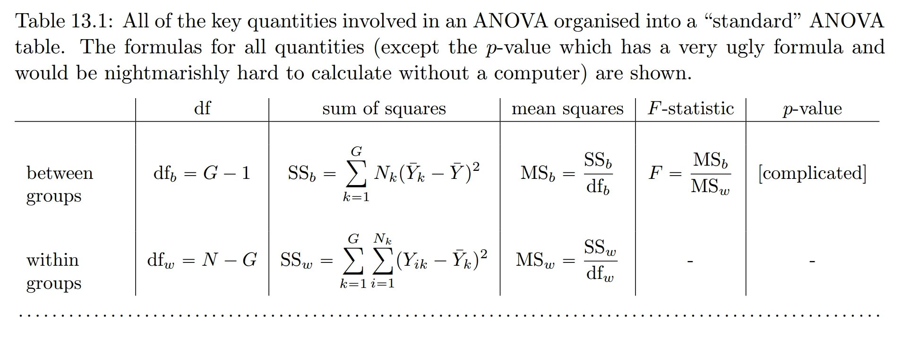

``` {r setup, include = F}
# Settings
knitr::opts_chunk$set(echo = F, warning = F, dpi = 150, fig.height = 4)
# Load packages
library('magrittr');library('knitr')
# Set colors
source('/home/jrl/work/resmeth/slides/variables.R')
# TODO: Add illustrations on factorial ANOVA and interactions
# stevedata::Guber99 for Simpson's paradox
```

class: center middle clean

# Are differences between groups higher than within groups?

---

class: center middle inverse

# Two sources of variation in data

---

## Why analysis of variance?

Variance expresses mean squared deviation from average:

$$Var(X) = \frac{1}{N} \sum{^N_{i=1}{(X_i-\bar{X})^2}},$$

where $X_i$ is the value of observation $i$ and $\bar{X}$ the mean value.

---

Let's use data of some iris flowers for illustration.


.footnote[https://dodona.ugent.be/en/activities/779139786/]

---

Variance is a measure of how different on average are **individual values from mean value**.

``` {r}
par(bty = 'n', mar = c(1,4,1,0), family = 'RobotoCondensed')
plot(rep(1, nrow(iris)) %>% jitter, iris$Sepal.Length, xaxt = 'n', xlab = NA)
abline(h = mean(iris$Sepal.Length), ylab = "Sepal.Length", lwd = 2, col = Col['red'])
```

--

These differences represent **variation** in data.

???
Average squared difference from the mean.

---

We can actually separate variation in into two parts:

$$Var(Y) = \frac{1}{N} \sum^{G}_{j=1}{\sum^{N_k}_{i=1}{(Y_{ij} - \bar{Y})^2}},$$ 

where 
- $N$ is the number of all observations, 
- $Y_{ij}$ is the value of variable $Y$ for observation $i$ in group $j$, and 
- $\bar{Y}$ the overall mean of variable $Y$ of all observations in all samples.

---

```{r, fig.height = 5}
par(bty = 'n', mar = c(4,4,0,0), family = 'RobotoCondensed')
plot(Sepal.Length ~ jitter(as.numeric(Species)), iris, xaxt = 'n', xlim = c(.5,3.5), 
       xlab = "Species", ylab = "Sepal.Length")
axis(1, at = 1:3, labels = levels(iris$Species))
abline(h = mean(iris$Sepal.Length), ylab = "Sepal.Length", lwd = 2, col = Col['red'])
```

---

## The two parts as a linear model

We can also express each value as a model that distinguishes between the two sources of variation:

$$Y_{ij}=\bar{x}+\alpha_{j}+\varepsilon_{ij},$$

where 
- $Y_{ij}$ is the value of $Y$ for observation $i$ from group $j$, 
- $\bar{x}$ the overall mean, 
- $\alpha_{i}$ the difference between mean of group $j$ and overall mean $\bar{x}$, and 
- $\varepsilon_{ij}$ the difference between group mean and value for observation $i$ from factor $j$.

---

Total variation can be expressed as the deviation of each observation from the mean.

$$Y_{ij}= \bar{x} + \varepsilon_{i}$$

``` {r}
Sequences <- tapply(iris$Species, iris$Species, seq_along) %>% unlist
Oie <- iris[Sequences < 4, c('Species', 'Sepal.Length')]
cbind(Oie, x = mean(Oie$Sepal.Length), 
      epsilon_i = Oie$Sepal.Length - mean(Oie$Sepal.Length)) %>% 
  kable
```

---

We can also separate factor $\alpha$ from total variation:

$$Y_{ij}=\bar{x}+\alpha_{j}+\varepsilon_{ij},$$

- $Y_{ij}$ is the value for observation $i$ from group $j$, 
- $\bar{x}$ the overall mean, 
- $\alpha_{i}$ the difference between mean of group $j$ and overall mean $\bar{x}$, and 
- $\varepsilon_{ij}$ the difference between group mean and value for observation $i$ from factor $j$.

---

class: center middle

$$Y_{ij}=\bar{x}+\alpha_{j}+\varepsilon_{ij}$$

``` {r}
Sequences <- tapply(iris$Species, iris$Species, seq_along) %>% unlist
Oie <- iris[Sequences < 4, c('Species', 'Sepal.Length')]
cbind(Oie, 
      x = mean(Oie$Sepal.Length), 
      epsilon_i = Oie$Sepal.Length - mean(Oie$Sepal.Length), 
      alpha_j = tapply(Oie$Sepal.Length, Oie$Species, mean)[Oie$Species] - mean(Oie$Sepal.Length), 
      epsilon_ij = Oie$Sepal.Length - tapply(Oie$Sepal.Length, Oie$Species, mean)[Oie$Species]) %>% 
  kable
```

---

For

$$Y_{ij}=\bar{x}+\alpha_{j}+\varepsilon_{ij},$$

there are two sources of variation: 
- variation **between groups**, expressed by $\alpha_{j}$
- random variation **within a group**, expressed by $\varepsilon_{ij}$

--

The idea behind ANOVA is comparing these two sources of variation. 

If the variation between groups is much higher than variation within groups, we can say that the groups are different not only in our sample but also in population.

---

class: center middle inverse

# Comparing the two sources of variation

---

## One way ANOVA

Assumptions:

- normality within each group
- independence
- homogeneity of variance (only for Welch's test)

???
I will discuss the homogeneity of variance later.

---

Let's use data set "Multi-environment trial of sorghum at 3 locations across 5 years". We wish to compare yields in different locations in 2004.

```{r}
sorg <- agridat::adugna.sorghum
sorg <- sorg[sorg$year == 2004, ]
```

.pull-left[
``` {r}
head(sorg) %>% kable
```
]

.pull-right[
``` {r}
table(loc = sorg$loc) %>% kable
```
]

---

### Hypotheses

Are mean values equal? 

$H_0: \bar{x}_1 = \bar{x}_2 = \bar{x}_3$  
$H_1: \bar{x}_1 = \bar{x}_2 \neq \bar{x}_3$ or $\bar{x}_1 \neq \bar{x}_2 \neq \bar{x}_3$

--

In other words, our $H_1$ is that at least one  group mean is different from others.

---

Is mean yield different among locations? Does location have an effect on yield?

```{r, echo = F}
par(bty = 'n', mar = c(4,4,0,0), family = 'RobotoCondensed')
plot(yield ~ jitter(as.numeric(loc)), sorg, xaxt = 'n', xlim = c(.5,3.5), 
       xlab = "Location", ylab = "Yield, kg/ha")
axis(1, at = 1:3, labels = levels(sorg$loc))
for (i in 1:3) {
  lines(list(c(0.75, 1.25), c(1.75, 2.25), c(2.75, 3.25))[[i]], 
        tapply(sorg$yield, sorg$loc, mean)[c(i,i)], 
        lwd = 2, col = Col['red'])
  }
```

???
Do we even need ANOVA? Yes, because this is only a sample.

--

Let's set significance level $\alpha = 0.05$. 

---

### Test statistic $F$

Test statistic $F$ is calculated as 

$F = MSA / MSE,$

where $MSA$ expresses variation between group and $MSE$ represents random variaton. 

---

Sums of squares of variable $y$ for observations $i$ in groups $j$:

- **within-group** sum of squares, i.e. sum of squares of errors (SSE)  
  $SSE=\sum_{j=1}^{k}\sum_{i=1}^{n} (y_{ij}-\overline{y_{j}})^{2}$, $df = n - k$
- **between group** sum of squares, i.e. sum of squares between groups (SSA)  
  $SSA=\sum_{j=1}^{k} (\overline{y_{j}}-\overline{y})^{2}$, $df = k - 1$
- **total** sum of squares (SST=SSE+SSA)  
  $SST=\sum_{j=1}^{k}\sum_{i=1}^{n} (y_{ij}-\overline{y})^{2}$, $df = n - 1$

---

We can use these variations to find $MSA$ and $MSE$ to calculate $F = MSA / MSE$ as follows:

- mean squares for SSE (MSE)
  $MSE = SSE / (n - k)$
- mean squares for SSA (MSA)
  $MSA = SSA / (k - 1)$
  
---

> Why are we taking **sums of squares** instead of using just sums?

---

If we simply sum the differences, the result would be zero, i.e. no variation.

``` {r}
sorg3 <- sorg[c(12,23,34), ]
with(sorg3, cbind(sorg3, x = mean(yield), epsilon_i = yield - mean(yield))) %>% 
  tail %>% kable
```

``` {r, echo = T}
(sorg3$yield - mean(sorg3$yield)) %>% sum %>% round
(sorg3$yield - mean(sorg3$yield))^2 %>% sum %>% round
```

???
Does it have to be this complicated? 

---

The test statistic $F = MSA / MSE$ simply compares within-group differences to between group differences.

```{r, fig.height = 5}
par(bty = 'n', mar = c(4,4,0,0), family = 'RobotoCondensed')
plot(yield ~ jitter(as.numeric(loc)), sorg, xaxt = 'n', xlim = c(.5,3.5), 
       xlab = "Location", ylab = "Yield, kg/ha")
axis(1, at = 1:3, labels = levels(sorg$loc))
for (i in 1:3) {
  lines(list(c(0.75, 1.25), c(1.75, 2.25), c(2.75, 3.25))[[i]], 
        tapply(sorg$yield, sorg$loc, mean)[c(i,i)], 
        lwd = 2, col = Col['red'])
  }
abline(h = mean(sorg$yield), lwd = 2, col = Col['blue'])
```

---

class: middle

.center[]

.footnote[Navarro D.J., Foxcroft D.R. (2018). Learning statistics with jamovi: a tutorial for psychology students and other beginners. Danielle J.  Navarro and David R. Foxcroft. doi:10.24384/HGC3-7P15]

---

### Test statistic $F$ on F-distribution

``` {r}
Test <- summary(aov(yield ~ loc, sorg))
```

Value of test statistic is `r Test[[1]]['F value'][1, ] %>% round(3)`. Test statistic is evaluated on t-distribution with df $k - 1$ and $n - k$.

``` {r}
curve(df(x, df1 = Test[[1]]['Df'][1, ], df2 = Test[[1]]['Df'][2, ]), 0, 30, 
      main = "F-distribution (df1 = 2, df2 = 81)", xlab = "Test statistic", ylab = "Density")
abline(v = Test[[1]]['F value'][1,1], lwd = 2, col = Col['red'])
abline(v = 3.11, lwd = 2, col = Col['blue']) # Critical value regarding df.
```

---

P-value is `r Test[[1]]['Pr(>F)'][1, ] %>% round(3)` and we chose significance level to be $\alpha = 0.05$.

> Is mean yield different among locations? 

> Does location have an effect on yield?

---

class: center middle inverse

# Post-hoc tests and checking homogeneity of variance

---

## Tukey HSD

We found that at least one group is different from others. But which one(s)?

--

We can use post-hoc tests to see pairwise differences. An example test is **Tukey HSD** (hhonest significant differences).

``` {r}
tukey <- TukeyHSD(aov(yield ~ loc, sorg))
tukey
```

---

We can also plot differences in means along with their **confidence intervals**.

``` {r, fig.height = 4.5}
plot(tukey)
```

???
All CIs are outside 0.

---

## Levene's test of homogeneity of means

For each observation we 
1. calculate its difference from its group mean, and then
2. use ANOVA to test if these within-group differences are different. 

--

$H_0: s_1 = s_2 = s_3$  
$H_1: s_1 = s_2 \neq s_3$ or $s_1 \neq s_2 \neq s_3$

If we fail to reject $H_0$ (p-value is $\ge \alpha$), then we conclude that all groups have the same variance.

---

``` {r}
car::leveneTest(yield ~ loc, sorg)
```

--

> Are variances homogenous? 

--

> What to do if they are not?

---

class: center middle inverse

# Practical application

---

1. Download the data set `chickwts` from the course notes.
2. Go to cloud.jamovi.org.
3. Open the data set in Jamovi.

> Are the weights normally distributed in each diet?

> Are the samples independent?

> Are variances of diets homogenous?

> Does diet have an impact on weight?

---

class: inverse