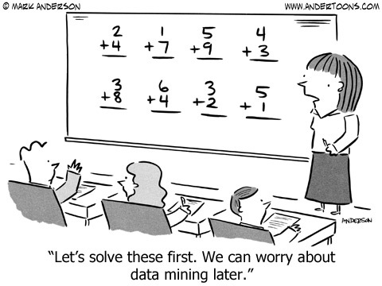

``` {r setup, include = F}
# Settings
knitr::opts_chunk$set(echo = F, dpi = 150, fig.height = 4)
# Load packages
library('magrittr');library('knitr')
# TODO: Fix headings
```

## A story of drawing inferences

.small[
... a man walked into a Target outside Minneapolis and demanded to see the manager. He was clutching coupons that had been sent to his daughter, and he was angry, according to an employee who participated in the conversation.

“My daughter got this in the mail!” he said. “**She’s still in high school, and you’re sending her coupons for baby clothes and cribs?** Are you trying to encourage her to get pregnant?”

... The manager apologized and then called a few days later to apologize again.

On the phone, though, the father was somewhat abashed. “I had a talk with my daughter,” he said. “It turns out there’s been some activities in my house I haven’t been completely aware of. **She’s due in August. I owe you an apology.**”
]

.footnote[Duhigg C. (2012). How Companies Learn Your Secrets. The New York Times]

---

class: middle



---

class: center middle clean

# What are we going to do?

---

## What and how?

--

A distinct part of MS.0825 Research methods course. 

---

Complete **tests** via course page on Moodle.

--

**Flipped classroom** approach

---

class: center

Traditoinal classroom

**No preparation -> Lecture -> Homework**

--
<br>

Flipped classroom

**Preparaton ->  Lecture and discussion -> Practice with feedback**

---

## Study materials

Detailed information about the course is at [www.lillemets.ee/researchmethods/notes](http://www.lillemets.ee/researchmethods/notes).

Texts for reading are referred in notes and available online.

The notes contain the information presented on the slides more thoroughly.

---

Why not upload slides?


---

## Aims

After completing the course students should be able to:

- understand basic concepts in statistics;  
- know how to describe data, both numerically and visually;   
- choose an appropriate method to solve a problem;  
- use statistical software for data analysis;  
- communicate the results of an analysis (interpret, explain, present);  
- learn about statistical methods individually;   
- find the courage to apply statistical methods.

---

After completing the curriculum successfully, the students:

.smaller[
1. **demonstrate knowledge of contemporary theory and techniques of economics and business administration;**
2. demonstrate in-depth knowledge of agricultural value chains;
3. **utilize scientific research in business administration;**
4. develop an ethical and socially responsible corporate culture through human resource management;
5. evaluate investments and design corporate financial policy;
6. understand the role of innovation and manage innovation process in their organisation;
7. evaluate competitive situation in their field of operation;
8. identify gap in existing knowledge, products and services and need for research;
9. **design a research plan to solve practical problems in their field of operation;**
10. **apply acquired knowledge in writing master thesis;**
11. **effectively communicate research results;**
12. demonstrate effective communication and networking skills;
13. organize and participate in team work;
14. effectively represent organisation in business negotiations;
15. demonstrate ethical and socially responsible leadership and management skills in the context of global marketplace, complex organisations and multinational teams;
16. recognize cultural diversity, its challenges and opportunities in conducting business;
17. demonstrate understanding of the ethical consequences of business decisions;
18. demonstrate understanding of global issues in context of agricultural business, concerning social, economic, political and environmental problems.
]

---

## Scoring

Quantitative part gives you 50% of the Research methods course points. These are expressed as 50 points.

--

Answers to **tests** on the methods based on reading material.


???

Theoretical and practical part. Maybe you do something similar in other courses and can combine this somehow? Or combine with your thesis.

---

### Tests on reading material

Demonstrate your understanding of theory.

--

Complete a test during the beginning of each meeting to demonstrate your understanding of the topic and preparedness for discussion.

--

Tests consist of four questions, each contributing half of a point towards the final score.

???

Demonstrate understanding of theory. Tests are to motivate learning, to see if you read and make sure you are prepared for meetings. Feedback for myself on what you do or do not understand.

---

## Meetings

We have a total of 11 meetings.

1. Introduction. Descriptive statistics (today)
2. Hypothesis testing. Comparing categorical variables
3. Comparing numerical variables
4. Analysis of variance
5. Correlation analysis
6. Simple linear regression. Data transformations
7. Multiple linear regression
8. Logistic regression
9. Principal component analysis
10. Factor analysis
11. Clustering

---

class: center middle inverse

# Quantitative methods

---

### Quantitative and qualitative methods

| QuaNTitative         | QuaLitative           |
| -------------------- | --------------------- |
| Numeric data         | Semantic data         |
| Large-N              | Small-N, case studies |
| Generalize           | Explore               |
| Measure and test     | Understand            |
| Statistical analysis | Interpretation        |

???

Text mining. We're essentially going to learn statistics!

---

class: center middle inverse

# Statistics

---

class: center middle

## How would you define statistics?

???

Can mean data or methods

---


.footnote[Dash I. (2016). Flowchart of statistics for research. doi:10.13140/RG.2.2.12014.41283/1]

???

Taxonomy, flow chart. Making comparisons and finding patterns in data.

---

## Descriptive and inferential statistics

| Descriptive statistics      | Inferential statistics        |
| --------------------------- | ----------------------------- |
| Data on entire population   | Only a sample of a population |
| Simple measures (e.g. mean) | Point estimates and intervals |
| Describing                  | Generalizing                  |

---

## Frequentist and bayesian approach to statistics

| Frequentist                                         | Bayesian                                                   |
| --------------------------------------------------- | ---------------------------------------------------------- |
| Traditional                                         | Modern                                                     |
| What's the probability of data given some estimate? | What's the probability of an estimate?                     |
| Prior is not relevant                               | Estimates are conditional on priors                        |
| Single parametric inference                         | Multiplication of an inference to get a posterior estimate |

---

class: middle


.footnote[Xkcd. Frequentists vs Bayesians]

---

## Statistics and data science, machine learning, artificial intelligence, ...

| Statistics                   | DS, ML, AI, ...                |
| ---------------------------- | ------------------------------ |
| Less data                    | Big data                       |
| Clean datasets               | Untidy data in various formats |
| Traditonal methods           | Novel methods                  |
| Mathematics and calculations | Programming approach           |
| Aim is to explain            | Aim is to predict              |

---

class: center

General framework

**Data -> Model -> Prediction**

--
<br>

Statistics

**Data -> Model**

--
<br>

DS, ML, AI, ...

**Data -> ??? -> Prediction**

---

class: middle


.footnote[Xkcd. Machine learning]

---

class: center middle inverse

# Software

---

## What software can we use for quantitative analysis?

Spreadsheet and statistical software

--

- Spreadsheet - table management (e.g. Microsoft Excel, Google Sheets, LibreOffice Calc)
- SPSS - simple GUI-based app with limited functionality
- R - extensible programming language designed for data analysis
- Stata - Mostly CLI-based app, well suited for econometrics
- SAS, Matlab, Statistica, ...

???

You could also use Excel as other students in this institute.


---

class: middle


.footnote[Xkcd. Making progress]

???

Spreadsheets require a lot of repetitive manual work. Plotting is limited.

---

## What are we going to use?

To apply the methods we learn, we will use [Jamovi](https://www.jamovi.org/). 

> Jamovi is a new “3rd generation” statistical spreadsheet. designed from the ground up to be easy to use, jamovi is a compelling alternative to costly statistical products such as SPSS and SAS.

> Jamovi is built on top of the R statistical language, giving you access to the best the statistics community has to offer.

---

## You can also use R

R is based on S language originating from 1970's. Developed during 1990's and became public around 2000.

> R is a language and environment for statistical computing and graphics.

> R provides a wide variety of statistical (linear and nonlinear modelling, classical statistical tests, time-series analysis, classification, clustering, …) and graphical techniques, and is highly extensible. 

RStudio is a convenient GUI for R.

A wide variety of uses via RMarkdown and Knitr.

???

Programming language similar to any other but developed paricularly for data analysis. Includes many statistical procedures for various fields. Constantly extended by the community with novel methods. Abundant possibilities for plotting data. CLI. The bookdown and presentations are written in R. Demonstrate usage and then ask. 

---

.pull-left[

#### Why a programming language?

- Free and open source
- Powerful and extensible
- Allows for reproducibile analysis
- Active and helpful community
- Used and useful in academia and research

]

.pull-right[

#### Why not?

It's unconventional and has a steep learining curve:

- must feel comfortable with CLI, 
- requires programming skill, 
- data is not constantly visible, 
- no undo.

]

???

Draw a plot to illustrate the learning curve of other software vs R.

---

class: center middle 

# How can we format data?

---

## Data structure

To apply statistical procedures data should be formatted according to the "tidy data" principle:

1. Every column is a variable.
2. Every row is an observation.
3. Every cell is a single value.

--

Data table can be in a long or wide format.

???

Most statistical procedures require 2-dimensional tidy data. 

---

Tidy data (long format): Each row is a  single observation.

``` {r}
Indometh <- Indometh[Indometh$time > 2, ]
head(Indometh)
```

Untidy data (wide format): variable `time` is spread into different columns, so each row is not truly an observation.

``` {r}
wide <- reshape(Indometh, v.names = "conc", idvar = "Subject",
                timevar = "time", direction = "wide")
head(wide)
```

???

Wide and long format. Explain why some procedures don't work when time variable is not in a single column.

---

## Scales of measurement

|  Scale   | Measure property | Operations |       Central tendency        |
| :------: | :--------------: | :--------: | :---------------------------: |
| Nominal  |  Classification  |    =, ≠    |             Mode              |
| Ordinal  |      Level       |    >, <    |            Median             |
| Interval |    Difference    |    +, −    |        Arithmetic mean        |
|  Ratio   |    Magnitude     |    ×, /    | Geometric mean, harmonic mean |

Scales must be kept in mind so that values are treated correctly.

Scales determine the procedures that can be applied to the data. 

???

E.g. when nominal variables are coded as numbers they should not be treated as numeric. Temperature example. Software might print meaningless results if it e.g. treats nominal variables as numeric.

---

#### Binary variables

Can take only two values, usually 0 and 1.

``` {r}
islands <- as.factor(sample(names(islands)[1:4], 10, replace = T))
islands %>% data.frame %>% cbind(model.matrix(~islands + 0))
```

--

The sum and mean of binary variables coded as 0 and 1 are meaningful. What do these show?

---

### Continuous or discrete variables

**A continuous variable** is one in which, for any two values that you can think of, it’s always logically possible to have another value in between.

**A discrete variable** is, in effect, a variable that isn’t continuous. For a discrete variable it’s sometimes the case that there’s nothing in the middle.

---

Discrete variable: the number of a car's gears must be an integer.

``` {r, echo = T}
mtcars$gear
```

Continuous variable: weight of a car may have any positive value (up to a certain point).

``` {r, echo = T}
mtcars$wt
```

---

### Scales in statistical software

The difference between binary, ratio, interval variables is only theoretical. Statistical software treats all numbers as numeric variables.

--

Measure types in Jamovi: nominal, ordinal, continuous (and ID)

Variable types in R: logical, character, factor, integer, float

---

class: center middle clean

# How do describe data?

---

Any data analysis should begin with and include the description of values.

Descriptive statistics only allows us to describe the data we have. We can not make inferences on population if we only have a sample.

For nominal and ordinal variables we can count them and find mode and/or mean. For sequence of numbers there is a variety of measures for describing values.

---

class: center middle

How would you describe this sequence of values?

``` {r}
values <- Orange$circumference[1:12]
values
```

???

Simplistic but necessary part on analysis. E.g. using survey results to make inferences. Circumference of orange trees at breast height (mm).

---

class: center middle inverse

## Central tendency

???

A concise way to represent numeric values is expressing the center of values. Central value, typical value, expected value. Note that estimating a central tendency is only meaningful if the distribution of values is unimodal.

---

### Mode

Mode is simply the most frequent value in a sequence. 

--

``` {r, echo = T}
sort(values)
```

--

Numeric variables often don't have a mode and it is usually not meaningful anyway.

???

Useful for nominal and ordinal variables but rarely used for numeric variables, especially on a continuous scale.

---

### Median

When sequence of values is ordered, the value in the middle is median. 

--

``` {r, echo = T}
sort(values)
length(values)
median(values)
```

???

Case when odd or even number of values in sequence.

---

### Mean

We consider the arithmetic mean.

It's the sum of values divided by number of values:

$$\bar{X} = \frac{1}{N} \sum{^N_{i=1}}{X_i}$$

In statistics, mean is often referred to as expected value, i.e. $E(x)$.

---

``` {r, echo = T}
values
sum(values)
length(values)
sum(values) / length(values)
```

---

### Mean or median?

Which do you think is which here?

``` {r}
set.seed(123)
par(mar = c(2,4,2,4))
v <- c(rnorm(100, mean(values), sd(values)), 
       rnorm(50, mean(values)+200, sd(values)+100))
hist(v, 10, freq = F, main = NULL, xlab = NULL)
lines(density(v))
abline(v = c(mean(v), median(v)), col = '#018c81', lwd = 2)
```

---

class: center middle inverse

## Variability

???

Central tendency tells nothing about the deviation of values from that mean. Variability provides another perspective.

---

### Range

Most simple way to express variability is to indicate the range of all values, i.e. the minimum and maximum values.

--

``` {r, echo = T}
sort(values)
range(values)
```

---

### Quantiles

Quantiles can be found by dividing ordered sequence of values into $k$ equally sized groups. Quantiles then represent the lower bounds of these groups.

Median is the 2nd quantile when $k = 2$. When $k = 4$ quantiles are called quartiles and deciles (percentiles) when $k = 100$.

--

``` {r, echo = T}
sort(values)
quantile(values, probs = seq(0, 1, .1)) # Deciles
```

---

Interquartile range (IQR) is the difference between 2nd and 4th quartiles.

``` {r, echo = T}
quantile(values) # Quartiles
quantile(values)[4] - quantile(values)[2]
IQR(values)
```

???
Percentiles are not used very often but they are great for describing values.

---

### Variance

Variance is mean squared difference from the mean value:

$$Var(X) = \frac{1}{N} \sum{^N_{i=1}{(X_i-\bar{X})^2}}$$

--

``` {r, echo = T}
values
mean(values)
var(values)
```

???
Useful only in statistical calculations.

---

### Standard deviation

Standard deviation is the square root of variance.

$$s(X) = \sqrt{ \frac{1}{N} \sum{^N_{i=1}{(X_i-\bar{X})^2}}}$$

--

``` {r, echo = T}
sort(values)
mean(values)
sd(values)
```

---

Standard deviation together with mean are useful for description of normally distributed values.

``` {r}
set.seed(123)
v <- rnorm(100, mean(values), sd(values))
hist(v, 10, freq = F, main = NULL, xlab = NULL)
lines(density(v))
m <- mean(v)
abline(v = c(m, m - sd(v), m + sd(v)), col = '#018c81', lwd = 2)
```

---

``` {r} 
#TODO: Make this more elegant
par(mfrow = 1:2)
# Larger
set.seed(123)
v <- rnorm(100, mean(values), sd(values)*2)
hist(v, freq = F, main = NULL, xlab = NULL, 
     xlim = c(mean(values) - 300,mean(values) + 300))
lines(density(v))
m <- mean(v)
abline(v = c(m, m - sd(v), m + sd(v)), col = '#018c81', lwd = 2)
# Smaller
set.seed(123)
v <- rnorm(100, mean(values)/2, sd(values)/2)
hist(v, freq = F, main = NULL, xlab = NULL, 
     xlim = c(mean(values) - 300,mean(values) + 300))
lines(density(v))
m <- mean(v)
abline(v = c(m, m - sd(v), m + sd(v)), col = '#018c81', lwd = 2)
```


---

class: center middle inverse

## Plots

???

Plotting allows to present values more intuitively or even depict all of the values at once.

---

class: middle

Why do we need plots?


---

### Scatterplot

We can simply plot values of one variable against another.

``` {r, echo = F}
plot(circumference ~ age, Orange, col = Tree)
```

---

### Boxplot

Boxplots illustrate the quartiles of values and extreme values. 

Half of all the values lie within the box and another half on the lines, outliers excluded.

---

``` {r, echo = F}
quantile(Orange$circumference)
par(mar = c(2,4,1,4))
boxplot(Orange$circumference)
```

---

Boxplots are useful for comparing values in groups.

``` {r}
par(mar = c(4,4,0,0))
boxplot(circumference ~ age, Orange)
```

???

Age is in days.

---

### Histogram

Histograms are essentially barplots where all values are divided between ranges of equal with, i.e. bins.

--

``` {r, fig.height = 3}
sort(Orange$circumference)
b <- seq(min(Orange$circumference), max(Orange$circumference)+20, 20)
par(mar = c(4,4,0,0))
hist(Orange$circumference, b, main = NULL, xlab = NULL, xaxt = 'n')
axis(1, b, b)
```

---

### Density plot

Instead of bins, distribution of values can also be expressed continuously by smoothing the bins.

Smoothing is done using some bandwidth and kernel smoothing algorithm.

--

``` {r, fig.height = 3}
par(mfrow = 1:2, mar = c(4,4,0,0))
plot(density(Orange$circumference), main = NULL)
hist(Orange$circumference, freq = F, main = NULL, xlab = NULL)
lines(density(Orange$circumference))
```

---

Sometimes you just shouldn't create a graph.


.footnote[Xkcd. Self-description]

---

class: middle

Graphs should be self-explanatory


.footnote[Xkcd. Convincing]

---

class: inverse
