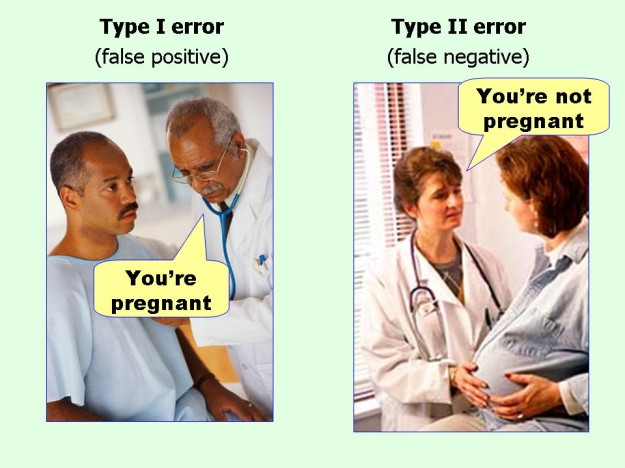

``` {r setup, include = F}
# Settings
knitr::opts_chunk$set(echo = F, dpi = 150, fig.height = 4)
# Load packages
library('magrittr');library('knitr')
# Set colors
source('/home/jrl/work/resmeth/slides/variables.R')
# TODO: Use dataset occupationalStatus
# TODO: Add an example about chi-squared test of independence
```

## A story of a hypothesis testing

A paper was published about chocolate as a weight-loss accelerator.

.smaller[
> Remarkably, participants in the chocolate group lost more weight than those of the low-carb group.

> Consumption of chocolate with a high cocoa content can significantly increase the success of weight-loss diets.

> Therefore, we recommend the consumption of high cocoa content chocolate during nutritional interventions.

>... high cocoa content chocolate is therefore an ideal "weight-loss turbo" if used in combination with a low-carb intervention for weight loss.
]

.footnote[Bohannon, J., Koch, D., Homm, P., Driehaus, A., 2015. Chocolate with High Cocoa Content as a Weight-Loss Accelerator. Global Journal of Medical Research 15, 9–14.]


---

It was a hoax but media quickly picked it up.


.footnote[Bohannon, J., 2015. I Fooled Millions Into Thinking Chocolate Helps Weight Loss. Here’s How. Gizmodo.]

---

class: center middle

## How could we use data to show that chocolate help lose weight?

---

class: center middle clean

# Does the difference in sample also exist in population?

---

class: center middle inverse

# Population and sample

---

## What to do if you only have a sample?

When we have data on the entire population we can simply describe it using descriptive statistics. 

But often we only have data about a part of a **population**, i.e. a **sample**.

--

Since we only have data on sample, we can't be sure if same properties hold for population.

Hence, we need to **make inferences** about the population by estimating population parameters from sample data.

--

We can make inferences with a **particular certainty**, i.e. confidence interval or error ratio.

---

class: middle

## *Sampling bias* 


.footnote[Sketchplanations. Sampling bias]

---

class: middle

## *Survivorship bias*

Classical example: bullet holes in returning aircraft.
How should we improve the airplanes?


---

class: middle


.footnote[Xkcd. Survivorship bias]

???

If you poll those who play Russian roulette, you'll conclude that it's completely safe. 

---

## Sampling processes

*Simple random sample* occurs when each observation in population had exactly equal probability of being in sample.

--

Usually the sampling process is not random and we have

- convenience sampling, 
- snowball sampling, 
- stratified sampling, 
- ...

---

## Sample should be random

Randomness is **highly relevant** for drawing inferences and generalizing about population.

This only needs to apply to those aspects that are relevant for our research.

---

Suppose that we are examining **household income** of some kids. Does it matter if we include only males in sample?

``` {r}
data(GSOEP9402, package = 'AER')
gsoep <- GSOEP9402
makePlot <- function(data, subset = TRUE, main) {
  par(mar = c(4,.1,2,1.), bty = 'n', yaxt = 'n', family = 'RobotoCondensed')
  plot(density(data[subset]), 
       main = main, xlab = 'Income, DM?', ylab = '', 
       xlim = range(data))
}
par(mfrow = c(1,2))
for (i in sort(unique(gsoep$gender))) {
  makePlot(gsoep$income, gsoep$gender == i, i)
  abline(v = mean(gsoep$income[gsoep$gender == i]), lwd = 2, col = Col['red'])
  abline(v = mean(gsoep$income), lwd = 2, lty = 'dotted', col = Col['blue'])
}
```

---

Can we make generalizations using a sample collected from one state?

``` {r}
par(mfrow = c(3,4))
for (i in sort(unique(gsoep$state))) {
  makePlot(gsoep$income, gsoep$state == i, i)
  abline(v = mean(gsoep$income[gsoep$state == i]), lwd = 2, col = Col['red'])
  abline(v = mean(gsoep$income), lwd = 2, lty = 'dotted', col = Col['blue'])
}
```

---

## The law of large numbers

As sample size increases, sample parameters tend to approach population parameters in their values.

Sample becomes more similar to population as we add observations.

The more observations there are in a sample, the more accurate are the inferences drawn about population using that sample.

---

The **mean** of the sampling distribution is the same as the mean of the population.

``` {r, fig.height = 3}
par(mfrow = c(1,5))
howMany <- c(2,5,10,100,500)
for (i in howMany) {
  makePlot(gsoep$income, 1:i, paste("n = ", i))
  abline(v = mean(gsoep$income[1:i]), lwd = 2, col = Col['red'])
  abline(v = mean(gsoep$income), lwd = 2, lty = 'dotted', col = Col['blue'])
}
```

---

The **standard deviation** of the mean (i.e., the standard error) gets smaller as the sample size increases

``` {r, fig.height = 3}
par(mfrow = c(1,5))
for (i in howMany) {
  makePlot(gsoep$income, 1:i, paste("n = ", i))
  stDevSamp <- sqrt(var(gsoep$income[1:i])/length(gsoep$income[1:i]))
  abline(v = mean(gsoep$income[1:i]), lty = 'dotted', col = Col['red'])
  abline(v = mean(gsoep$income[1:i]) - stDevSamp, lwd = 2, col = Col['red'])
  abline(v = mean(gsoep$income[1:i]) + stDevSamp, lwd = 2, col = Col['red'])
}
```

---

The shape of the sampling **distribution** becomes normal as the sample size increases (*Central limit theorem*).

``` {r, fig.height = 3}
par(mfrow = c(1,6))
for (i in howMany) makePlot(gsoep$income, 1:i, paste("n = ", i))
curve(dnorm(x, mean(gsoep$income), sd(gsoep$income)), 
      min(gsoep$income), max(gsoep$income), main = "Normal\ndistribution")
```

---

## Normal distribution

A lot of things in real life tend to follow normal distribution. So we assume that a random variable does this, too.

``` {r}
makePlot(gsoep$income, main = "Observed and equivalent normal distribution")
curve(dnorm(x, mean(gsoep$income), sd(gsoep$income)), 
      min(gsoep$income), max(gsoep$income), 
      col = Col['blue'], add = T)
```

---

## Estimate of the population mean

Our best estimate of population mean is sample mean, i.e. 

$$\hat{\mu} = \bar{x}.$$

---

## Estimate of the population standard deviation

Standard deviation (SD) in a sample tends to be lower than population standard deviation. 

--

Thus, **estimate of standard devation needs to be corrected for bias** as follows:

$$\hat{\sigma} = \sqrt{\frac{1}{n-1} \sum{^n_{i=1}{(x_i-\bar{x})^2}}}.$$
This is called *standard error of the mean* (*SEM*).

---

For smaller number of observations ( $n$ ) **SD** tends to be smaller while the **true error** of our estimate is larger. So we increase SD for smaller samples.

``` {r}
par(mfrow = c(2,5))
for (i in howMany) {
  makePlot(gsoep$income, 1:i, paste("SD, n = ", i))
  stDevSamp <- sd(gsoep$income[1:i])
  abline(v = mean(gsoep$income[1:i]), lty = 'dotted', col = Col['red'])
  abline(v = mean(gsoep$income[1:i]) - stDevSamp, lwd = 2, col = Col['red'])
  abline(v = mean(gsoep$income[1:i]) + stDevSamp, lwd = 2, col = Col['red'])
  abline(v = mean(gsoep$income), lwd = 2, col = Col['blue'])
}
for (i in howMany) {
  makePlot(gsoep$income, 1:i, paste("SEM, n = ", i))
  stDevSamp <- sqrt(var(gsoep$income[1:i])/length(gsoep$income[1:i]))
  abline(v = mean(gsoep$income[1:i]), lty = 'dotted', col = Col['red'])
  abline(v = mean(gsoep$income[1:i]) - stDevSamp, lwd = 2, col = Col['red'])
  abline(v = mean(gsoep$income[1:i]) + stDevSamp, lwd = 2, col = Col['red'])
  abline(v = mean(gsoep$income), lwd = 2, col = Col['blue'])
}
```

---

## Confidence interval of the mean

Whenever we draw an inference about population from our sample, there is always a **degree of uncertainty**. We can calculate this uncertainty as confidence intervals.

We assume that our sample data comes from a population with **normally distributed** variable of interest.

--

Then *95% confidence interval (CI) of the mean* can be found as follows:

$$CI_{95} = \hat{x} \pm(1.96\times\frac{\sigma}{\sqrt{N}}).$$
---

Mean is `r mean(gsoep$income) %>% round(0) %>% format(sci = F)`and  confidence intervals are `r t.test(gsoep$income)$conf.int %>% round(0) %>% format(sci = F)`.

``` {r}
makePlot(gsoep$income, main = "Observed and equivalent normal distribution")
curve(dnorm(x, mean(gsoep$income), sd(gsoep$income)), 
      min(gsoep$income), max(gsoep$income), 
      col = Col['blue'], add = T)
abline(v = mean(gsoep$income), lwd = 1, lty = 'dotted', col = Col['red'])
abline(v = t.test(gsoep$income)$conf.int[1], lwd = 2, col = Col['red'])
abline(v = t.test(gsoep$income)$conf.int[2], lwd = 2, col = Col['red'])
```

???

The CI is perpendicular to the equivalent normal distribution because we assume that this is how data is distributed.

---

$CI_{95}$ **does not** indicate a 95% probability that true mean lies within the CI! It means that 95% of samples contain the true mean.


???

No intuitive interpretation. It just means that we're pretty sure that population mean is within the CI.

---

### Why 1.96 for 95% CI?

For normally distributed standardized data, we expect 95% of values to lie no further than 1.96 units from the mean.

``` {r}
curve(dnorm(x, 0, 1), -3, 3, xlab = "Values", ylab = "Probability")
abline(v = c(-qnorm(.975), qnorm(.975)), col = 'deeppink')
```

???

If distribution was not symmetric we would have different intervals. Data is not standardized, hence the multiplication with SD.

---

class: center middle inverse

# Statistical hypothesis testing

with the example of 

# Comparing categorical data

---

class: center middle clean

# Is there a difference in frequencies?


---

## Statistical hypotesis is not research hypothesis

Hypothesis is in research a statement about the expected results of research.

*Research hypothesis* does not have to be direcly related to data and does not have a particular form or wording.

*Statistical hypothesis* is strictly related to some difference in data and has two forms: null and alternative hypotheses.

---

## Why statistical hypothesis testing?

Is the color of M&Ms in a bag random? Let's look at 30 bags of M&Ms.

--

```{r, fig.height = 3}
mm <- read.csv('/home/jrl/work/resmeth/docs/data/mm.csv')
plotMm <- function(x){
  barplot(unlist(mm[x, 2:7]), xaxt = 'n', main = x, col = names(mm[, 2:7]))
}
par(mfrow = c(3,10), mar = rep(1,4))
sapply(1:nrow(mm), plotMm) %>% invisible
```

???
Silly example but there's an application in agri-food business.

---

If these were the observed frequencies, we could say that frequencies are different.

```{r}
plotMm(23)
```

---

However, here we can't be so sure.

```{r}
plotMm(19)
```

---

## What about sample and population?

Does our sample of observed values come from the population represented by expected values? 

```{r}
par(mfrow = 1:2, mar = rep(2,4))
plotMm(19)
barplot(sum(mm[19, 2:7])/6 %>% rep(6), main = "Expected", 
        ylim = c(0,12), col = names(mm[, 2:7]), xaxt = 'n')
```

## Goodness of fit $\chi^2$-test

We wish to know if the frequencies of categories are different from expected values.

Observed frequencies in bag 19:

``` {r}
kable(mm[19, 2:7])
```

Expected frequencies if we expect an equal number of all colors:

``` {r}
kable(sum(mm[19, 2:7])/6 %>% rep(6) %>% t, col.names = names(mm[, 2:7]))
```

???
Also empirical and theoretical. We can also choose different expected values.

---

## Test statistic

The value of a test statistic indicates how extreme the differences are.

The test statistic for goodness of fit $\chi^2$-test is calculated as

$$\chi^2 = \sum{^k_{i=1}{\frac{(O_i-E_i)^2}{E_i}}}$$

--

``` {r}
test <- chisq.test(mm[19, 2:7])
obs <- test$observed
exp <- test$expected
```

``` {r, echo = T, results = 'hold'}
obs
exp
sum((obs - exp)^2 / exp)
```

???
The higher the differences, the higher the test statistic.

---

## P-value

This is the probability that a sample value (e.g. the difference) is equal to or more extreme than true value if null hypothesis is true.

Thus, it's the rate of committing a type I error, i.e. the significance level $\alpha$. 

For testing we set a threshold for p-value **beforehand**, conventionally 0.05.

Conventionally, $\alpha = 0.05$. So we accept the rate of committing a type I error of 5%.

???
Why set p-value beforehand. We need to make some concessions, hence need to accept error.

---

P-value is the holy grail in research.


.footnote[Xkcd. P-values]

---

P-value for $\chi^2$ = `r test$statistic` on `r test$parameter` DoF is `r test$p.value`. Why?

``` {r}
par(mar = c(4,4,0,0))
curve(dchisq(x, test$parameter), 0, 10, 
      xlab = "Test statistic (chi-squared)", ylab = "Probability")
abline(v = test$statistic, lwd = 2, col = 'cyan') # Our result
abline(v = test$statistic, lwd = 2, col = 'cyan') # Needed
abline(v =qchisq(.95, test$statistic), lwd = 1, col = 'deeppink')
```

---

## Hypotheses

We posit two hypotheses:

$H_0$: There **is no** statistically significant difference.<br>
$H_1$: There **is** a statistically significant difference.

--

We only test null hypothesis, $H_0$. When we can not confirm $H_0$, we accept the alternative hypothesis, $H_1$.

--

Suppose that $\alpha = 0.05$. If p-value is $\ge 0.05$, we retain $H_0$. If p-value is $\lt 0.05$, we reject $H_{0}$ and accept $H_1$.

--

P-value is **not** the probability of $H_0$ being false or $H_1$ being true!

---

Hypotheses for for goodness of fit $\chi^2$-test:

$H_0$: Frequencies of categories are as expected.<br>
$H_1$: Frequencies of categories are different from what is expected.

---

class: middle

We can not **prove** anything with hypothesis testing.


.footnote[Xkcd. Null hypothesis]

???
Statistics is about what data shows not proving or disproving anything.
---

### Two types of errors

We can make two types of errors when making a conclusion about $H_0$:

|                | We retain $H_0$             | We reject $H_0$            |
| -------------- | --------------------------- | -------------------------- |
| $H_0$ is true  | We are correct              | We commit **type I error** |
| $H_0$ is false | We commit **type II error** | We are correct             |

The rate of type I error is considered the significance level of a test (denoted as $\alpha$). **Conventionally, $ \alpha = 0.05 $**, so we are willing to accept that type I error occurs 5% of times.

---



---

class: center middle

Our p-value is `r test$p.value` and $\alpha = 0.05$.

## Are the frequencies of M&M colors in bag 19 random?

???

NHST. Theoretically, the value of p-value itself is not important.

---

##  $\chi^2$-test of independence

This is done as in previous example, except that we now sum both row and column differences:

$$\chi^2 = \sum{^r_{i=1}\sum{^c_{j=1}}{\frac{(O_{ij}-E_{ij})^2}{E_{ij}}}}.$$

Hypotheses for $\chi^2$-test of independence:

$H_0$: Variables are independent.<br>
$H_1$: Variables are associated.

---

## Multiple testing problem

.smaller[

> Onneken and Löbl wasted no time. They used Facebook to recruit subjects around Frankfurt, offering 150 Euros to anyone willing to go on a diet for 3 weeks. They made it clear that this was part of a documentary film about dieting, but they didn’t give more detail. On a cold January morning, **5 men and 11 women** showed up, aged 19 to 67.

> ... If you measure a large number of things about a small number of people, you are almost guaranteed to get a "statistically significant" result. Our study included **18 different measurements** - weight, cholesterol, sodium, blood protein levels, sleep quality, well-being, etc.—from 15 people. (One subject was dropped.) That study design is a recipe for **false positives**.

> **Think of the measurements as lottery tickets**. Each one has a small chance of paying off in the form of a “significant” result that we can spin a story around and sell to the media. The more tickets you buy, the more likely you are to win. 

> With our 18 measurements, we had a **60% chance of getting some "significant" result with p < 0.05**. (The measurements weren’t independent, so it could be even higher.)

> It’s called **p-hacking** - fiddling with your experimental design and data to push p under 0.05 - and it’s a big problem. Most scientists are honest and do it unconsciously. They get negative results, convince themselves they goofed, and repeat the experiment until it "works." Or they drop "outlier" data points.
]

.footnote[Bohannon, J., 2015. I Fooled Millions Into Thinking Chocolate Helps Weight Loss. Here’s How. Gizmodo.]

---

class: inverse
