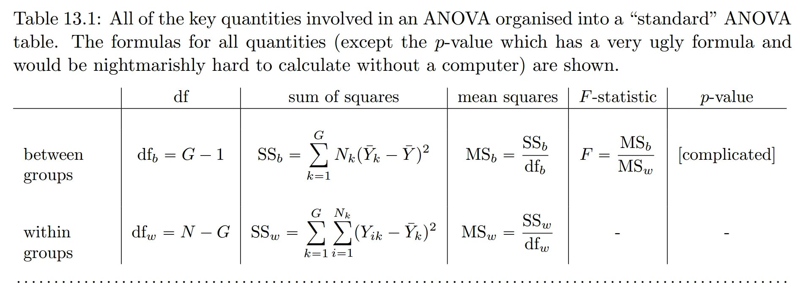

``` {r setup, include = F}
# Settings
knitr::opts_chunk$set(echo = F, warning = F, dpi = 150, fig.height = 4)
# Load packages
library('magrittr');library('knitr')
# Set colors
Col <- c(red = '#e6457a', green = '#b0e645', blue = '#45cbe6')
```

class: center middle clean

# Are differences between groups higher than within groups?

---

class: center middle inverse

# Hypothesis testing as a model

---

How can we express variation in a variable? We can specify relationship as a model:

$$Y_{ij}=\mu+\varepsilon_{i},$$ 

where 

- $Y$ is the value for observation $i$ from group $j$, 
- $\mu$ the overall mean, and 
- $\varepsilon_{ij}$ the difference between overall mean $\mu$ and value for observation $i$.

---

class: center middle

$Y_{ij}=\mu+\varepsilon_{i}$

``` {r}
Sequences <- tapply(iris$Species, iris$Species, seq_along) %>% unlist
Oie <- iris[Sequences < 4, c('Species', 'Sepal.Length')]
cbind(Oie, mu = mean(Oie$Sepal.Length), epsilon_i = Oie$Sepal.Length - mean(Oie$Sepal.Length))
```

???

---

We can also separate factor $\alpha$ from other variables:

$$Y_{ij}=\mu+\alpha_{j}+\varepsilon_{ij},$$

- $Y$ is the value for observation $i$ from group $j$, 
- $\mu$ the overall mean, 
- $\alpha_{i}$ the difference between mean of group $j$ and overall mean $\mu$, and 
- $\varepsilon_{ij}$ the difference between group mean and value for observation $i$ from factor $j$.

---

class: center middle

$Y_{ij}=\mu+\alpha_{j}+\varepsilon_{ij}$

``` {r}
Sequences <- tapply(iris$Species, iris$Species, seq_along) %>% unlist
Oie <- iris[Sequences < 4, c('Species', 'Sepal.Length')]
cbind(Oie, 
      mu = mean(Oie$Sepal.Length), 
      alpha_j = tapply(Oie$Sepal.Length, Oie$Species, mean)[Oie$Species] - mean(Oie$Sepal.Length), 
      epsilon_ij = Oie$Sepal.Length - tapply(Oie$Sepal.Length, Oie$Species, mean)[Oie$Species])
```

---

For

$$Y_{ij}=\mu+\alpha_{j}+\varepsilon_{ij},$$
there are two sources of variation: 

- variation between groups, i.e. $\alpha_{j}$
- random variation within a group, i.e. $\varepsilon_{ij}$

--

The idea behind Anova is comparing these. If the variation between groups is higher that variation within groups by a certain degree, we can say that there's an effect.

---

class: center middle inverse

# Comparing sources of variation

---

## One way Anova

Assumptions:

- normality
- independence
- homogeneity of variance (only for Welch's test)

---

Let's use data set "Multi-environment trial of sorghum at 3 locations across 5 years". We wish to compare yields in different locations.

```{r}
sorg <- agridat::adugna.sorghum
sorg <- sorg[sorg$year == 2004, ]
```

``` {r, echo = T}
head(sorg)
table(sorg$loc)
```

---

### Hypotheses

Are mean values equal? 

$H_0: \bar{x}_1 = \bar{x}_2 = \bar{x}_3$  
$H_1: \bar{x}_1 = \bar{x}_2 \neq \bar{x}_3$ or $\bar{x}_1 \neq \bar{x}_2 \neq \bar{x}_3$

--

In other words, our $H_1$ is that at least one  group mean is different from others.

---

Is mean yield different among locations? Does location have an effect on yield?

```{r, echo = F}
par(bty = 'n', mar = c(4,4,0,0), family = 'RobotoCondensed')
plot(yield ~ jitter(as.numeric(loc)), sorg, xaxt = 'n', xlim = c(.5,3.5), 
       xlab = "Location", ylab = "Yield, kg/ha")
axis(1, at = 1:3, labels = levels(sorg$loc))
for (i in 1:3) {
  lines(list(c(0.75, 1.25), c(1.75, 2.25), c(2.75, 3.25))[[i]], 
        tapply(sorg$yield, sorg$loc, mean)[c(i,i)], 
        lwd = 2, col = Col['red'])
  }
```

--

Let's set significance level $\alpha = 0.05$. 

---

### Test statistic $F$

Test statistic $F$ is calculated as 

$F = MSA / MSE,$

where $MSA$ expresses variation between group and $MSE$ represents random variaton. 

---

Sums of squares of variable $y$ for observations $i$ in groups $j$:

- within-group sum of squares, i.e. sum of squares of errors (SSE)  
  $SSE=\sum_{j=1}^{k}\sum_{i=1}^{n} (y_{ij}-\overline{y_{j}})^{2}$, $df = n - k$
- between group sum of squares, i.e. sum of squares between groups (SSA)  
  $SSA=\sum_{j=1}^{k} (\overline{y_{j}}-\overline{y})^{2}$, $df = k - 1$
- total sum of squares (SST=SSE+SSA)  
  $SST=\sum_{j=1}^{k}\sum_{i=1}^{n} (y_{ij}-\overline{y})^{2}$, $df = n - 1$

We can use these variations to find $MSA$ and $MSE$ as follows:

- mean squares for SSE (MSE)
  $MSE = SSE / (n - k)$
- mean squares for SSA (MSA)
  $MSA = SSA / (k - 1)$
  
---

Does it have to be this complicated? Why are we taking **sums of squares** instead of just sums?

---

```{r, fig.height = 5}
par(bty = 'n', mar = c(4,4,0,0), family = 'RobotoCondensed')
plot(yield ~ jitter(as.numeric(loc)), sorg, xaxt = 'n', xlim = c(.5,3.5), 
       xlab = "Location", ylab = "Yield, kg/ha")
axis(1, at = 1:3, labels = levels(sorg$loc))
for (i in 1:3) {
  lines(list(c(0.75, 1.25), c(1.75, 2.25), c(2.75, 3.25))[[i]], 
        tapply(sorg$yield, sorg$loc, mean)[c(i,i)], 
        lwd = 2, col = Col['red'])
  }
abline(h = mean(sorg$yield), lwd = 2, col = Col['blue'])
```

???
Draw lines and legend in different colors. Are blue lines greater than red lines?

---

class: middle

.center[]

.footnote[Navarro D.J., Foxcroft D.R. (2018). Learning statistics with jamovi: a tutorial for psychology students and other beginners. Danielle J.  Navarro and David R. Foxcroft. doi:10.24384/HGC3-7P15]

---

### Test statistic $F$ on F-distribution

``` {r}
Test <- summary(aov(yield ~ loc, sorg))
```

Value of test statistic is `r Test[[1]]['F value'][1, ] %>% round(3)`. Test statistic is evaluated on t-distribution with df $k - 1$ and $n - k$.

``` {r}
curve(df(x, df1 = Test[[1]]['Df'][1, ], df2 = Test[[1]]['Df'][2, ]), 0, 30, 
      main = "F-distribution (df1 = 2, df2 = 81)", xlab = "Test statistic", ylab = "Density")
abline(v = Test[[1]]['F value'][1,1], lwd = 2, col = Col['red'])
abline(v = 3.11, lwd = 2, col = Col['blue']) # Critical value regarding df.
```

---

P-value is `r Test[[1]]['Pr(>F)'][1, ] %>% round(3)` and we chose significance level to be $\alpha = 0.05$.

> Is mean yield different among locations? Does location have an effect on yield?

---

class: center middle inverse

# So which groups are different?

---

We can use post-hoc tests to see pairwise differences. An example test is Tukey honest significant differences.

``` {r}
tukey <- TukeyHSD(aov(yield ~ loc, sorg))
tukey
```

---

We can also plot confidence intervals of the differences in means. 

``` {r, fig.height = 4.5}
plot(tukey)
```

???
All CIs are outside 0.

---

class: inverse

---

## Practice

1. Download the data set `chickwts` from the course notes.
2. Go to cloud.jamovi.org.
3. Open the data set in Jamovi.

> Are the weights normally distributed?
>
> Are the samples independent?
>
> Which test should you use to see if diet has an impact on weight?
