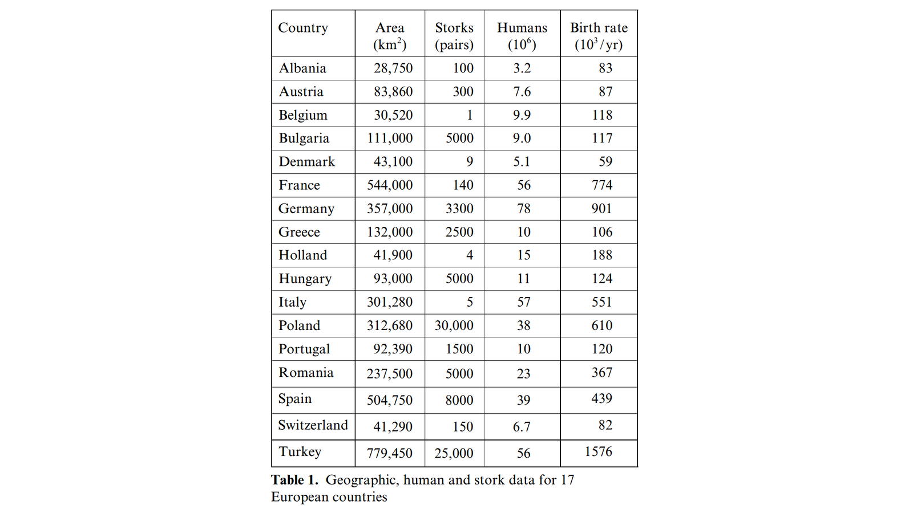

``` {r setup, include = F}
# Settings
knitr::opts_chunk$set(echo = F, warning = F, dpi = 150, fig.height = 4)
# Load packages
library('magrittr');library('knitr');library('DiagrammeR')
# Set colors
source('/home/jrl/work/resmeth/slides/variables.R')
# TODO: Add an example of a large heatmap
```

class: center middle clean

# How are two variables associated?

---

class: center middle inverse

# Covariation

---

When we want to understand how two variables are associated, then we need to examine how they **vary** together.

--

So we need to estimate their **covariation**.

--

**Covariance** between variables $x$ and $y$ can be calculated as follows:

$$Cov(x,y) = \frac{1}{n-1} \sum^n_{i=1}(x_i - \bar{x})(y_i - \bar{y})$$

---

Let's look at data on "Speed and Stopping Distances of Cars".

``` {r}
head(cars, 10) %>% kable
```

---

``` {r, fig.height = 5}
par(bty = 'n', mar = c(4,4,0,0), family = 'RobotoCondensed')
plot(cars, xlab = "Speed, mph", ylab = "Stopping distance, ft")
```

???

Draw lines of possible relationships.

---

The value of covariance is not very meaningful itself and can not be interpreted.

```{r}
cov(cars) %>% kable
```

--

We need something else ...

---

class: center middle inverse

# Correlation coefficients

---

There are several different ways to calculate correlation but they all have the same interpretation:

- Minimum value is -1 and maximum value is 1.
- Value of 0 indicates lack of any correlation.
- Value of -1 or 1 indicates perfect correlation.
- Negative value indicates inverse (negative) relationship, positive value direct (positive) relationship.

---

## Parametric and nonparametric correlation

We can distinguish between two types of correlation coefficients: **parametric** and **nonparametric**.

--

When we use **raw values**, then 

- we use differences from **mean**, 
- which is a **parametric** method and 
- we measure **linearity** of association.

--

When we use **ranking of values**, then 

- we use **ranks**, 
- which is a **nonparametric** method and 
- we measure **monotonicity** of association.

---

What is the difference in practice? Parametric correlation 

- uses more information and is thus **more powerful**,  
- is limited to **normally distributed interval or ratio data** and 
- measures the **linearity and not monotonicity** of association.

???

Why do we say that parametric correlation uses more information?

---

> Why do we say "parametric" when we use mean?

--

``` {r}
par(mfrow = 1:2, bty = 'n', family = 'RobotoCondensed')
Mu <- mean(rbeta(1e3,10,4))
curve(dnorm(x,Mu,1),xlim=c(-4,4), 
      main = "Normally distributed data", xlab = NA, ylab = NA)
abline(v = Mu, col = Col['red'], lwd = 2)
curve(dbeta(x,10,3),xlim=c(0,1), 
      main = "Right-skewed data", xlab = NA, ylab = NA)
abline(v = Mu, col = Col['red'], lwd = 2)
```

---

## Linearity and monotonicity

.pull-left[

Monotonically increasing linear relationship

```{r, fig.height = 7}
par(bty = 'n', family = 'RobotoCondensed')
set.seed(123)
x <- rnorm(100, 100)
y <- x + rnorm(100, 0, .5)
plot(x, y, axes = F, xlab = NA, ylab = NA, cex.main = 2, 
     main = paste(
       "Pearson's r = ", cor(x, y) %>% round(3), "\n", 
       "Spearman's rho = ", cor(x, y, method = 'spearman') %>% round(3)))
```

]

--

.pull-right[

Monotonically increasing non-linear relationship

```{r, fig.height = 7}
par(bty = 'n', family = 'RobotoCondensed')
set.seed(123)
x <- runif(100, 0, 100)
y <- x^(1/3) + rnorm(100, 0, .5)
plot(x, y, axes = F, xlab = NA, ylab = NA, cex.main = 2, 
     main = paste(
       "Pearson's r = ", cor(x, y) %>% round(3), "\n", 
       "Spearman's rho = ", cor(x, y, method = 'spearman') %>% round(3)))
```

]

---

Correlation does not tell us all about the underlying data. This is why you should create scatterplots!


---

## Pearson’s correlation coefficient

A **parametric** method that evaluates **linearity** of an association.

The calculation assumes  

- **interval or ratio** data,
- **normally distributed** data, 
- **linearity** of relationship, and
- a lack of substantial **outliers**.

---

*Pearson's $r$* for association between variables $x$ and $y$ can be calculated as follows:

$$r = \frac{\sum_{i=1}^{n}(x_i-\bar{x})(y_i-\bar{y})}{\sum_{i=1}^{n}(x_i-\bar{x})^2 \sum_{i=1}^{n}(y_i-\bar{y})^2}$$ 

Essentially, we compare differences from mean value for values of each variable.

---

``` {r, fig.height = 5}
par(bty = 'n', family = 'RobotoCondensed')
plot(cars, xlab = "Speed, mph", ylab = "Stopping distance, ft", 
     main = paste("Pearson's r = ", cor(cars)[2] %>% round(3)))
```

---

## Spearman rank-order correlation coefficient

A **nonparametric** method that evaluates **monotonicity** of an association.

The calculation assumes  

- **ordinal**, interval or ratio data, and
- **monotonicity** of association.

---

*Spearman's $\rho$* for association between variables $x$ and $y$ can be calculated as follows:

$$\rho = 1 - \frac{6\sum (R(x_{i})-R(y_{i}))^{2}}{n(n^{2}-1)}$$

Simply put, we compare ranks of values from each group.

---

What are ranks?

.pull-left[
Raw values.
``` {r}
head(cars, 10) %>% kable
```
]

.pull-right[
Ranks of raw values
``` {r}
head(cars, 10) %>% lapply(rank) %>% as.data.frame %>% kable
```
]

---

``` {r, fig.height = 5}
par(bty = 'n', family = 'RobotoCondensed')
plot(cars, xlab = "Speed, mph", ylab = "Stopping distance, ft", 
     main = paste("Pearson's r = ", cor(cars)[2] %>% round(3), "\n", 
                  "Spearman's rho = ", cor(cars, method = 'spearman')[2] %>% round(3)))
```

---

## Kendall rank correlation

Equivalent to Spearman's rank-order correlaton coefficient. A **nonparametric** method that evaluates **monotonicity** of an association.

The calculation assumes  

- **ordinal**, interval or ratio data, and
- **monotonicity** of association.

---

*Kendall's $\tau$* for association between variables $x$ and $y$ can be calculated as follows:

$$\tau = \frac{n_c - n_d}{\frac{1}{2} n (n-1)}$$

We are essentially evaluating if rankings of $x$ and $y$ are similar when we compare all observations pairwise.

---

``` {r, fig.height = 5}
par(bty = 'n', family = 'RobotoCondensed')
plot(cars, xlab = "Speed, mph", ylab = "Stopping distance, ft", 
     main = paste("Pearson's r =", cor(cars)[2] %>% round(3), "\n", 
                  "Spearman's rho =", cor(cars, method = 'spearman')[2] %>% round(3), "\n", 
                  "Kendall's tau =", cor(cars, method = 'kendall')[2] %>% round(3)))
```

---

### Spearman's $\rho$ and Kendall's $\tau$

As opposed to Kendall's $\tau$, Spearman's $\rho$ is 

- **more simple** to compute, 
- less suitable for **small sample sizes** and 
- can not be directly **interpreted**.

---

## Size and direction of coefficients

``` {r, fig.height = 4.5}
par(bty = 'n', family = 'RobotoCondensed', mfrow = c(2,3), mar = c(0,0,3.5,0))
for (i in c(1, -1)) {
  for (j in c(1, .5, .1)) {
    x <- rnorm(100, 0, 1)
    y <- x * i + rnorm(100, 0, j)
    plot(x, y, axes = F, xlab = NA, ylab = NA, 
         main = paste(
           "Pearson's r = ", cor(x, y) %>% round(3), "\n", 
           "Spearman's rho = ", cor(x, y, method = 'spearman') %>% round(3), "\n", 
           "Kendall's tau = ", cor(x, y, method = 'kendall') %>% round(3)))
  }
}
```

---

## Interpretation

The value of a correlation coefficient can be interpreted by: 

- its sign that indicates if a correlation is **positive or negative**, 
- its absolute size to determine the **strength of the relationship**, and
- its **statistical significance**.

---

The interpretation of a correlation coefficient depends on particular variables and research area.

| Correlation  | Interpretation       |
| ------------ | -------------------- |
| -1.0 to -0.9 | Very strong negative |
| -0.9 to -0.7 | Strong negative      |
| -0.7 to -0.4 | Moderate negative    |
| -0.4 to -0.2 | Weak negative        |
| -0.2 to 0    | Negligible negative  |
| 0 to 0.2     | Negligible positive  |
| 0.2 to 0.4   | Weak positive        |
| 0.4 to 0.7   | Moderate positive    |
| 0.7 to 0.9   | Strong positive      |
| 0.9 to 1.0   | Very strong positive |

???

E.g. physics and social sciences

---

## Statistical significance

We can calculate the statistical significance for correlation coefficients using the following hypotheses:

$H_0:$ Variables are not associated,   
$H_1:$ Variables are associated.

--

> Can we say that the correlation also exists in population if we reject $H_0$?

---

P-value for Pearson's $r$ correlation coefficient can be found by calculating the probability of t-statistic on t-distribution:

$$t=r\sqrt{n-2}/\sqrt{1-r^{2}}$$

???

The higher the absolute value of correlation coefficient and the more observations it is based on, the more likely is the coefficient generalizable to population.

---

class: center middle inverse

# Correlation in practice

---

## Correlation matrices and heatmaps

We are rarely interested the correlation coefficient between two variables. Correlaton analysis is more useful when we wish to evaluate a lot of associations easily.

--

***Correlation matrices*** and ***heatmaps*** can be used to quickly find patterns in data.

This is particularly useful for data sets with large number of variables.

???

Easier than e.g. doing a lot of tests.

---

Let's look at "Swiss Fertility and Socioeconomic Indicators (1888) Data".

``` {r}
names(swiss)[6] <- 'Inf.Mort'
head(swiss, 10) %>% kable
```

---

### Pairs plot

This includes simply pairwise plots between all variables.

``` {r}
par(bty = 'n', family = 'RobotoCondensed')
psych::pairs.panels(swiss, hist.col = 'white', scale = T, col = Col['red'])
```

---

### Correlation matrix

.small[
``` {r}
cor(swiss) %>% round(3) %>% kable
```
]

---

### Heatmap

Heatmap is just the correlation matrix in colors.

.pull-left[
``` {r, fig.height = 7}
par(bty = 'n', family = 'RobotoCondensed')
pheatmap::pheatmap(cor(swiss), cluster_rows = F, cluster_cols = F, cex = 1.5)
```
]

--

.pull-right[

``` {r, fig.height = 7}
par(bty = 'n', family = 'RobotoCondensed')
pheatmap::pheatmap(cor(swiss), cex = 1.5)
```
]

---

class: center middle inverse

# Limitations of correlation

---

## Relationship might not be linear

Correlation coefficient tells us nothing about the shape of an underlying relationship.

---

### Anscombe's quartet

``` {r}
Oie <- read.table(header = T, text = '
x1	y1		x2	y2		x3	y3		x4	y4
10	8.04		10	9.14		10	7.46		8	6.58
8	6.95		8	8.14		8	6.77		8	5.76
13	7.58		13	8.74		13	12.74		8	7.71
9	8.81		9	8.77		9	7.11		8	8.84
11	8.33		11	9.26		11	7.81		8	8.47
14	9.96		14	8.1		14	8.84		8	7.04
6	7.24		6	6.13		6	6.08		8	5.25
4	4.26		4	3.1		4	5.39		19	12.5
12	10.84		12	9.13		12	8.15		8	5.56
7	4.82		7	7.26		7	6.42		8	7.91
5	5.68		5	4.74		5	5.73		8	6.89')
```

``` {r}
par(bty = 'n', family = 'RobotoCondensed', mfrow = c(2,2), mar = c(2,2,3,0))
for (i in 1:4) {
  temp <- Oie[, grep(i, names(Oie))]
  plot(temp, main = paste(
    "Pearson's r = ", cor(temp)[2] %>% round(3), "\n", 
    "Spearman's rho = ", cor(temp, method = 'spearman')[2] %>% round(3)), 
    col = Col['red'], pch = 20)
  abline(0, cor(temp)[2])
}
```

--

This is why you should plot your data!

???
We can see that Pearson's r is the same. But Spearman's rho considers monotonicity.


---

## Correlation does not imply causation

The fact that variables are associated does not mean that there is a causal relationship between them. 

--

In addition to one variable having an effect on another, high correlations are often the result of 

- a **spurious relationship** or
- a **confounding variable**.

???

Perhaps one of the most repeated ideas in teaching statistics.

---

### Spurious correlation


.footnote[Source: Xkcd. Cell phones]

---

### Confounding variable

#### Storks deliver babies ( $p = 0.008$ )

It is sometimes said that babies are delivered by storks . 

A study investigated the association between the number of breeding pairs of storks and birth rate.

---

Countries that have more pairs of storks tend to have higher birth rates as well.


.footnote[Matthews R. (2000). Storks Deliver Babies (p= 0.008). Teaching Statistics 22: 36–38. doi:10.1111/1467-9639.00013]

???
We can see that countries that have more storks also have a higher birth rate

---

.small[
> The existence of this correlation is confirmed by performing a linear regression of the annual number of births in each country (the final column in table 1) against the number of breeding pairs of white storks (column 3). This leads to a **correlation coeffcient of $r = 0.62$**, whose statistical significance can be gauged using the standard t-test, where $t=r\sqrt{n-2}/\sqrt{1-r^{2}}$ and $n$ is the sample size. In our case, ** $n = 17$ so that $t =  3.06$, which for $(n - 2) = 15$ degrees of freedom leads to a p-value of $0.008$**.

]

.footnote[Matthews R. (2000). Storks Deliver Babies (p= 0.008). Teaching Statistics 22: 36–38. doi:10.1111/1467-9639.00013]

---

> Why would the number of breeding pairs of storks and birth rate be associated?

--

.small[

> The most plausible explanation of the observed correlation is, of course, the existence of a **confounding variable: some factor common to both birth rates and the number of breeding pairs of storks** which - like age in the reading skill/shoe-size correlation - can lead to a statistical correlation between two
> variables which are not directly linked themselves. **One candidate for a potential confounding variable is land area**: readers are invited to investigate   this possibility using the data in table 1.

]

.footnote[Matthews R. (2000). Storks Deliver Babies (p= 0.008). Teaching Statistics 22: 36–38. doi:10.1111/1467-9639.00013]

---

#### What is a counfounding/intervening variable?

.pull-left[
$X$ is correlated to $Y$ , so we might think that $X$ causes $Y$ .

```{r}
grViz("digraph {rankdir=LR; node [shape = circle] X -> Y}", height = 200, width = 400)
```
]

--

.pull-right[
Actually both might be caused by $Z$ , which leads to the correlation between $X$ and $Y$. 
```{r}
grViz("digraph {rankdir=LR; node [shape = circle] X -> Y [dir=none]; Z -> X; Z -> Y}", height = 200, width = 400)
```
]

---

class: middle


.footnote[Source: Xkcd. Correlation]

---

class: center middle inverse

# Practical application

---

Use the data set `Fatalities`.

> Are variables normally distributed?

> Are relationships between variables linear?

> Which variables are associated to traffic fatalities?

---

Use the data set `PSID1976`.

> Are variables normally distributed?

> Are relationships between variables linear?

> Which variables are related to participation in the labor force in 1975?

You might need to recode some variables that are not numeric.

---

class: inverse

???

More correlation measures. Example data with a lot of variables.
