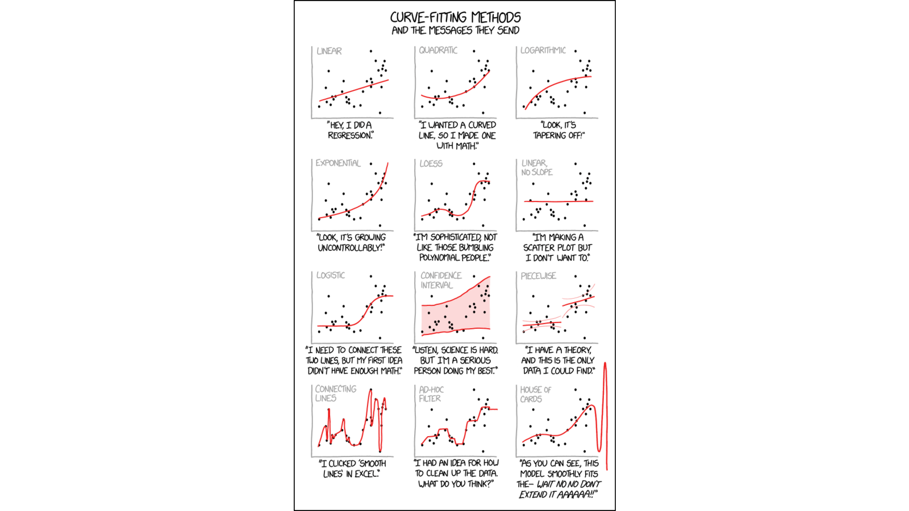

``` {r setup, include = F}
# Settings
knitr::opts_chunk$set(echo = F, warning = F, dpi = 300, fig.height = 4)
# Load packages
library('magrittr');library('knitr')
# Set colors
Col <- c(red = '#e6457a', green = '#b0e645', blue = '#45cbe6')
# Options
options(scipen = F, digits = 3)
# Parameters
Params <- function() par(bty = 'n', family = 'RobotoCondensed')
```

class: center middle clean

# How to improve the functional form of an OLS model?

???
Curve fitting

---

class: center middle inverse

# Log-transformations

---

For illustration let's use data on "Motor Trend Car Road Tests".

``` {r}
head(mtcars)
```

.small[
-	`mpg`	Miles/(US) gallon
- `cyl`	Number of cylinders
- `disp`	Displacement (cu.in.)
- `hp`	Gross horsepower
- `drat`	Rear axle ratio
- `wt`	Weight (1000 lbs)
- `qsec`	1/4 mile time
- `vs`	Engine (0 = V-shaped, 1 = straight)
- `am`	Transmission (0 = automatic, 1 = manual)
- `gear`	Number of forward gears
- `carb`	Number of carburetors
]

---

Let's try to predict miles per gallon (`mpg`) from horsepower (`hp`).

$$\text{mpg} = \alpha + \beta \text{hp} + \varepsilon$$

``` {r, fig.height = 3.5}
plotMpgHp <- function(formula) {
  Params(); par(mar = c(4,4,0,0))
  plot(formula, mtcars, xlab = "Gross horsepower", ylab = "Miles/(US) gallon")
}
plotMpgHp(mpg ~ hp)
```

---

Here is the model.

``` {r}
Formula <- mpg ~ hp
Model <- lm(Formula, mtcars)
summary(Model)
```

> Does horsepower have an effect on miles per gallon?

---

Let's now see if the assumptions related to normality and constant variance of residuals are fulfilled.

``` {r, fig.height = 3}
Params();par(mar = c(4,4,2,4), mfrow = 1:2)
plot(Model, 2:1)
```

--

> Are residuals normally distributed?

--

> Is the variance of residals constant?

---

What is the problem?

``` {r}
Params(); par(mar = c(4,4,0,0))
plot(Formula, mtcars, xlab = "Gross horsepower", ylab = "Miles/(US) gallon")
abline(Model, col = Col['red'])
```

---

## Log-linear model

When we use log-transformation on response variable, then we have a log-linear model.

$$ln(y) = \alpha + \beta x + \varepsilon$$

---

$$\text{ln(mpg)} = \alpha + \beta \text{hp} + \varepsilon$$

``` {r}
Formula <- log(mpg) ~ hp
Model <- lm(Formula, mtcars)
summary(Model)
```

---

``` {r, fig.height = 3.5}
Params(); par(mar = c(4,4,0,0))
plot(Formula, mtcars, xlab = "Gross horsepower", 
     ylab = "Miles/(US) gallon (log-transformed)")
abline(Model, col = Col['red'])
```

--

$ln(mpg_{i}) = `r Model$coef[[1]]` + `r Model$coef[[2]]` * hp_{i} + \varepsilon_{i}$

When `hp` increases by 1 unit, `mpg` increases by $`r Model$coef[[2]]` \times 100 = `r Model$coef[[2]] * 100`$ percent.

---

What about assumptions?

``` {r}
Params();par(mfrow = 1:2)
plot(Model, 1:2)
```

---

## Linear-log

When one or more predictors are used in logged form, then the model is referred to as a linear-log model:

$$y = \alpha + \beta ln(x) + \varepsilon$$

---

$$\text{mpg} = \alpha + \beta \text{ln(hp)} + \varepsilon$$

``` {r}
Formula <- mpg ~ log(hp)
Model <- lm(Formula, mtcars)
summary(Model)
```

---

``` {r, fig.height = 3.5}
Params(); par(mar = c(4,4,0,0))
plot(Formula, mtcars, xlab = "Gross horsepower (log-transformed)", 
     ylab = "Miles/(US) gallon")
abline(Model, col = Col['red'])
```

--

$mpg_{i} = `r Model$coef[[1]]` + `r Model$coef[[2]]` * ln(hp_{i}) + \varepsilon_{i}$

When `hp` increases by 1 per cent, `mpg` increases by $`r Model$coef[[2]]` / 100 = `r Model$coef[[2]] / 100`$ units.

---

How well the model fits data now?

``` {r}
Params();par(mfrow = 1:2)
plot(Model, 1:2)
```

---

## Log-log

When either of the previous transformations have not improved the fit of a linear model, we can also transform both response and predictor(s) as follows:

$$ln(y) = \alpha + \beta ln(x) + \varepsilon$$

---

$$\text{ln(mpg)} = \alpha + \beta \text{ln(hp)} + \varepsilon$$

``` {r}
Formula <- log(mpg) ~ log(hp)
Model <- lm(Formula, mtcars)
summary(Model)
```

---

``` {r, fig.height = 3.5}
Params(); par(mar = c(4,4,0,0))
plot(Formula, mtcars, xlab = "Gross horsepower (log-transformed)", 
     ylab = "Miles/(US) gallon (log-transformed)")
abline(Model, col = Col['red'])
```

$ln(mpg_{i}) = `r Model$coef[[1]]` + `r Model$coef[[2]]` * ln(hp_{i}) + \varepsilon_{i}$

When `hp` increases by 1 per cent, `mpg` increases by **`r Model$coef[[2]]` percent**.

---

Are the assumptions still satisfied?

``` {r}
Params();par(mfrow = 1:2)
plot(Model, 1:2)
```

---

Why did transforming the predictor (`hp`) improve model fit?

``` {r}
Params();par(mar = c(2,2,2,0), mfrow = c(2,2))
hist(mtcars$hp, 10)
hist(log(mtcars$hp), 10)
qqnorm(mtcars$hp)
qqnorm(log(mtcars$hp))
```

---

We should apply log-transformatins to variables that are  that are log-normally distributed.

``` {r, fig.height = 4.5}
Params();par(mar = c(4,4,0,0), mfrow = c(2,2), cex = .8)
plot(mpg ~ hp, mtcars, xlab = "Gross horsepower", ylab = "Miles/(US) gallon")
plot(log(mpg) ~ hp, mtcars, xlab = "Gross horsepower", 
     ylab = "Miles/(US) gallon (log-transformed)")
plot(mpg ~ log(hp), mtcars, xlab = "Gross horsepower (log-transformed)", 
     ylab = "Miles/(US) gallon")
plot(log(mpg) ~ log(hp), mtcars, xlab = "Gross horsepower (log-transformed)", 
     ylab = "Miles/(US) gallon (log-transformed)")
```

---

class: center middle inverse

# Polynomials

---

Introducing polynomials to a linear regression means including additional predictor(s) at power of $h$:

$y = \alpha + \beta_{1} x_1  + ... + \beta_{h} x_1^h + \varepsilon,$

where $h$ is called the degree of polynomial. For a quadratic relationship $k = 2$ and for a cubic relationship $k = 3$.

---

Let's try to solve the problem now with polynomial regression.

``` {r}
Params(); par(mar = c(4,4,0,0))
plot(mpg ~ hp, mtcars, xlab = "Gross horsepower", ylab = "Miles/(US) gallon")
```

--

There seems to be a quadratic relationship.

---

$$\text{mpg} = \alpha + \beta_1 \text{hp} + \beta_2 \text{hp}^2+ \varepsilon$$

``` {r}
Formula <- mpg ~ hp + I(hp^2)
Model <- lm(Formula, mtcars)
summary(Model)
```

---

Interpretation:

$$\text{mpg} = `r Model$coef[[1]]` + `r Model$coef[[2]]` \text{hp} + `r Model$coef[[3]]` \text{hp}^2 + \varepsilon$$

We can't really interpret the coefficients for $hp$ and $hp^2$ anymore.

There is a trade off between description and prediction, bias and variance.

---

Diagnostics

``` {r}
Params();par(mfrow = 1:2)
plot(Model, 1:2)
```

---

Why is the fit that good?

``` {r}
Params(); par(mar = c(4,4,0,0))
plot(mpg ~ hp, mtcars, xlab = "Gross horsepower", 
     ylab = "Miles/(US) gallon")
curve(predict(Model, list(hp = x)), min(mtcars$hp), max(mtcars$hp), 
      add = T, col = Col['red'])
```

???
Still linear in parameters!

---

What if the relationship is more complex? What if a regression line with two curves seems to fit best?

``` {r}
Params(); par(mar = c(4,4,0,0))
plot(disp ~ wt, mtcars, xlab = "Displacement (cu.in.)", 
     ylab = "	Weight (1000 lbs)")
```

---

Let's try to fit a 3rd degree polynomial, i.e. model the relationship as cubic.

$$\text{disp} = \alpha + \beta_1 \text{wt} + \beta_2 \text{wt}^2 + \beta_3 \text{wt}^3 + \varepsilon$$

``` {r}
Formula <- disp ~ wt + I(wt^2) + I(wt^3)
Model <- lm(Formula, mtcars)
summary(Model)
```

---

Diagnostics

``` {r}
Params();par(mfrow = 1:2)
plot(Model, 1:2)
```

---

``` {r}
Params(); par(mar = c(4,4,0,0))
plot(disp ~ wt, mtcars, xlab = "Displacement (cu.in.)", 
     ylab = "	Weight (1000 lbs)")
curve(predict(Model, list(wt = x)), min(mtcars$wt), max(mtcars$wt), 
      add = T, col = Col['red'])
```

---

Is the polynomial model statistically significantly better than a model without polynomials?

``` {r}
Params(); par(mar = c(4,4,0,0))
plot(disp ~ wt, mtcars, xlab = "Displacement (cu.in.)", 
     ylab = "	Weight (1000 lbs)")
curve(predict(Model, list(wt = x)), min(mtcars$wt), max(mtcars$wt), 
      add = T, col = Col['red'])
abline(lm(disp ~ wt, mtcars), col = Col['blue'])
```

---

### Ramsey RESET test

We can test if the difference of residuals in two models is statistically significant or not. If there is no difference, we should prefer the simpler model.

```{r}
anova(lm(disp ~ wt, mtcars), 
      lm(disp ~ wt + I(wt^2) + I(wt^3), mtcars))
```

$H_0: RSS_1 = RSS_2$  
$H_1: RSS_1 \neq RSS_2.$

--

> Should we prefer the model with polynomials?

---



.footnote[Xkcd.  
Curve fitting]

---

class: center middle inverse

# Practical application

---

Use the data set `Cigarette`.

Estimate number of packs per capita smoked (`packpc`) using average excise taxes (`taxs`) as a predictor.

``` {r, eval = F}
par(mfrow = 1:2)
plot(packpc ~ taxs, Ecdat::Cigarette)
plot(log(packpc) ~ log(taxs), Ecdat::Cigarette)
plot(lm(packpc ~ taxs, Ecdat::Cigarette), 1:2)
plot(lm(log(packpc) ~ log(taxs), Ecdat::Cigarette), 1:2)
qqnorm(Ecdat::Cigarette$taxs);qqnorm(log(Ecdat::Cigarette$taxs))
qqnorm(Ecdat::Cigarette$packpc);qqnorm(log(Ecdat::Cigarette$packpc))
```

> Are the assumptions of normality and equality of residuals satisfied?

--

> Which variable(s) could be logged to improve the normality of residuals? Explore the distribution of variables.

--

> Could we use polynomials? 

``` {r}
plot(lm(packpc ~ taxs, Ecdat::Cigarette), 1:2)
plot(lm(packpc ~ taxs + I(taxs^2), Ecdat::Cigarette), 1:2)
plot(packpc ~ taxs, Ecdat::Cigarette)
```

--

> Do higher taxes have an effect on smoking? What is the effect?

---

class: inverse
