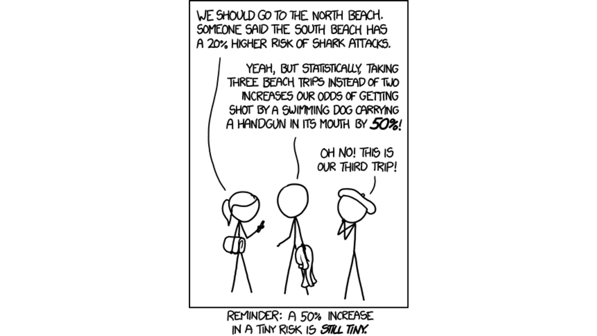

``` {r setup, include = F}
# Settings
knitr::opts_chunk$set(echo = F, warning = F, dpi = 200, fig.height = 4)
# Load packages
library('magrittr');library('knitr')
# Set colors
source('/home/jrl/work/resmeth/slides/variables.R')
# TODO: Illustration of maximizing likelihood. Explanation of odds from a contingency table. ROC and AUC. Deviance and other residuals.
```

class: center middle clean

# How to model a binary response?

???
Very often response variable is a dummy variable, describes event happening or not, etc.

---

class: center middle inverse

# Linear regression with two outcomes

---

Let's use a data set on emails to explain and predict spam.

``` {r}
Oie <- DAAG::spam7
Oie$spam <- as.numeric(Oie$yesno == 'y')
#Oie <- Oie[!(Oie$spam == 1 & Oie$dollar == 0), ] # Remove when spam but no dollar signs
Oie <- Oie[Oie$dollar < quantile(Oie$dollar, .99), ] # Include only lowest 99%
```

- `crl.tot` total length of words in capitals
- `dollar` number of occurrences of the "$" symbol
- `bang` number of occurrences of the "!" symbol
- `money` number of occurrences of the word "money"
- `n000` number of occurrences of the string "000"
- `make` number of occurrences of the word "make"
- `yesno` outcome variable, a factor with levels n not spam, y spam

---

What does the data look like?

.compact[
``` {r}
head(Oie, 20) %>% kable
```
]

---

Do occurrences of dollar symbol have an effect on categorizing an email as spam? Can we predict spam from dollar signs?

``` {r}
par(bty = 'n', family = 'RobotoCondensed', mar = c(4,4,0,0))
boxplot(dollar ~ spam, Oie, 
        xlab = "Occurrences of the $ symbol", ylab = "Spam", 
        horizontal = T)
```

---

Let's estimate a linear model where response `spam` is predicted from `dollar`.

``` {r}
modLin <- lm(spam ~ dollar, Oie)
summary(modLin)
```

---

This is how an ordinary linear model fits.

``` {r}
par(bty = 'n', family = 'RobotoCondensed', mar = c(4,4,0,0))
plotSpam <- function() {
  plot(jitter(spam, amount = .05) ~ dollar, Oie, 
       xlab = "Occurrences of the $ symbol", ylab = "Spam",
       yaxt = 'n', cex = .2)
  axis(2, 0:1, 0:1)
}
plotSpam()
abline(modLin, col = Col['red'], lwd = 2)
```

--

> Is this a good fit? Does the line make sense?

???

The line does not respect the boundaries of 0 and 1.

---

What about the assumptions?

``` {r}
par(bty = 'n', family = 'RobotoCondensed', mar = c(4,4,0,0), mfrow = 1:2)
plot(modLin, 1:2)
```

--

> Are the assumptions of normality and constant variance of residuals satisfied?

---

How are the errors distributed?

``` {r}
par(bty = 'n', family = 'RobotoCondensed', mar = c(4,4,0,0))
plot(density(modLin$resid),
     main = NA, xlab = "Residuals", ylab = '')
```

--

Assumptions of linear regression model can not be met when response is binary.

---

class: center middle inverse

# Estimation of generalized linear models

---

What to do if the distribution of errors is such that it can not meet assumptions of linear regression?

--

Specify a distribution of errors! For binary data we should use binomial distribution.

``` {r, fig.height = 3.5}
par(bty = 'n', family = 'RobotoCondensed', mfrow = c(1,3))
hist(Oie$spam,
     main = "Original distribution", xlab = "Spam", ylab = '')
hist(modLin$resid,
     main = "Residuals from the OLS model", xlab = "Spam", ylab = '')
hist(rbinom(nrow(Oie), nrow(Oie), mean(Oie$spam)),
     main = paste0("Binomial distribution\n (p = ", round(mean(Oie$spam), 3), " , n = ", nrow(Oie), ")"), 
     xlab = "Spam (number of spam)", ylab = '')
```

---

## Generalized linear models (GLM)

Least squares requires normal distribution of errors. So we can not use it if our response variable is a binary variable or contains counts.

Generalized linear models allow us to **specify an error distribution** prior to estimation.

--

In case of binary data we use *binomial distribution* to obtain a suitable error structure. 

Binomial distribution can be used to represent the proportion of successes at a particular number of trials.

---

Generalized linear models can also be used for other than binary response variable, e.g.

- normal data, 
- data with gamma distribution, 
- count data (incl. zero-inflated or zero-truncated response), 
- truncated or censored data.

???

Application of models is creative.

---

Let's estimate the same model now as a generalized linear model.

``` {r}
modLog <- glm(spam ~ dollar, Oie, family = binomial(link = 'logit'))
summary(modLog)
```

---

## Logit link

Link function relates the mean value of response to predictor variable(s), allowing us to **apply a particular distribution of errors**.

Link function **transforms the mean of response variable**.

--

For binary response variable we use the logit link (or probit link).

The logit link is mathematically expressed as follows:

$$ln(\frac{p}{1 - p}) = \alpha + \beta x,$$

where $p$ is the probability that $y = 1$.

---

What does the generalized version of the model look like?

``` {r}
par(bty = 'n', family = 'RobotoCondensed', mar = c(4,4,0,0))
plotSpam()
abline(modLin, col = Col['red'], lwd = 2)
curve(predict(modLog, list(dollar = x), type = 'response'), 
      min(Oie$dollar), max(Oie$dollar), 
      add = T, col = Col['blue'], lwd = 2)
```

--

> Why is it better than linear model?

---

A better illustration: predict transmission of a car from its weight.

``` {r}
par(bty = 'n', family = 'RobotoCondensed', mar = c(4,4,0,0))
plot(jitter(am, amount = .05) ~ wt, mtcars, 
     xlab = "Weight (1000 lbs)", ylab = "Transmission (0 = automatic, 1 = manual)",
     yaxt = 'n')
axis(2, 0:1, 0:1)
carMod <- glm(am ~ wt, data = mtcars, family = binomial(link = 'logit'))
curve(predict(carMod, list(wt = x), type = 'response'), 
      min(mtcars$wt), max(mtcars$wt), 
      add = T, col = Col['blue'], lwd = 2)
```

---

## Maximum likelihood estimation (MLE)

The parameters of a GLM can not be simply calculated as when using the least squares method. 

--

Models with various parameters are **iteratively** fitted until we find such parameters for which the data we have is most likely.

--

In case of OLS we use data to find most appropriate parameters.

With MLE we use parameters to see which are most suitable for data.

---

### Likelihood

Likelihood expresses how likely is the data we have given the parameters.

It can not be directly interpreted but it is used to calculate measures of model fit.

---

class: center middle inverse

# Interpretation and diagnostics

---

## Coefficients

The $\beta$ coefficient is the increase in logged odds that $y = 1$.

Recall the logit link $ln(\frac{p}{1 - p}) = \alpha + \beta x$, where $p$ is the probability that $y = 1$.

We are estimating log odds ratio: $\frac{p}{1-p} = e^{\alpha + \beta x}$.

Exponent of a coefficient is thus odds ratio: $\frac{p}{1-p} = \frac{p(y = 1)}{p(y \neq 1)}$.

---

### Odds

If odds are $\frac{1}{1} = 1$, then a unit increase of predictor **does not influence** the odds of $y = 1$.

If odds are $\frac{1}{2} = 0.5$, then a unit increase of predictor **decreases** the odds of $y = 1$ twice.

If odds are $\frac{2}{1} = 2$, then a unit increase of predictor **increases** the odds of $y = 1$ twice.

---

### Log odds

The coefficient is the logged odds of $y = 1$. 

--

We can convert the coefficient to probability of increase in odds by taking the exponent of it. 

In our example the $\beta_1$ was `r modLog$coefficients[2] %>% round(3)`. 

The exponent of this $\beta_1$ is `r exp(modLog$coefficients[2]) %>% format(sci = F)` ( $e^{\beta_1}$ ).

One unit increase in number of dollar signs increases the odds of a mail being spam `r exp(modLog$coefficients[2]) %>% format(sci = F)` times.

---

``` {r}
summary(modLog)
```

--

> Does the number of dollar symbols have an effect of email categorized as spam?

--

> Does an increase in the number of dollar symbols decrease the odds of email categorized as spam?

---



.footnote[Xkcd. Increased risk]

???
Odds ratios are difficult to interpret.

---

## Model fit

### Pseudo $R^2$

An alternative of $R^2$ for linear regression, although calculation and interpretation is different:

$$R^2 = 1 - \frac{ln\theta_{reduced}}{ln\theta_{full}},$$

where $\theta_{reduced}$ is the likelihood of model with only intercept and $\theta_{full}$ likelihood of model with predictors. 

The values lie between 0 and 1 and usually values  $>0.4$ are considered to indicate good fit.

???

How much does the addition of predictors improve the model.

---

### Likelihood ratio test

This test can be used to determine if a complex model is different from a simpler one:

$$LR = -2ln(\frac{\theta_1}{\theta_2}),$$

where $\theta_1$ is the likelihood of simpler model and $\theta_2$ the likelihood of complex model. The hypotheses are as follows:

$H_0: L_1 = L_2$  
$H_1: L_1 \neq L_2.$

If difference can not be shown, then the simpler model should be preferred. 

---

## Classification

### Probabilities

Fitted values of logistic regression model are $p$, i.e. the probability that $y = 1$:

$$p = \frac{e^{\alpha + \beta x}}{1 + e^{\alpha + \beta x}}$$

Value of $p$ lies between 0 and 1. 

--

For classification we thus need to choose a cutoff point.

---

We can use the model to predict whether an email is spam.

.small[

If cutoff point is .5

``` {r}
Dimensions <- c("Observed", "Classified")
table(Oie$spam, as.numeric(modLog$fitted > .3), dnn = Dimensions) %>% kable
```

If cutoff point is .2

``` {r}
table(Oie$spam, as.numeric(modLog$fitted > .5), dnn = Dimensions) %>% kable
```

If cutoff point is .1

``` {r}
table(Oie$spam, as.numeric(modLog$fitted > .7), dnn = Dimensions) %>% kable
```

]

---

### Confusion matrix

Classification table or a confusion matrix demonstrates the classification results.

``` {r}
addmargins(table(Oie$spam, as.numeric(modLog$fitted > .5), dnn = Dimensions)) %>% kable
```

--

We can calculate various measures from this table:

- accuracy: $(2676 + 884) / 4554 = 0.78$; 
- sensitivity: $883 / 993 = 0.89$; 
- specifity: $2676 / 3561 = 0.75$;
- ...

See the article about [Confusion matrix on Wikipedia](https://en.wikipedia.org/wiki/Confusion_matrix).

---

class: center middle inverse

# Practical application

---

Use the data set `PSID1976`.

Try to explain the participation in labor force (`participation`).

> Which variables should we use as predictors?

> What is the effect of empirically relevant predictors?

--

> Does our final model meet the assumptions of a linear model?

---

class: inverse